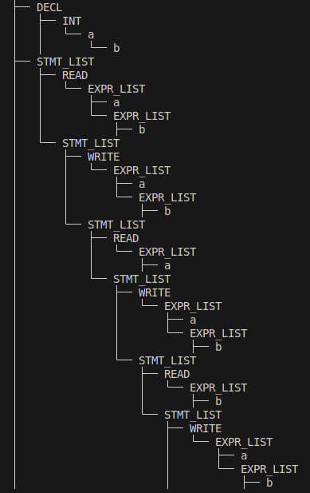
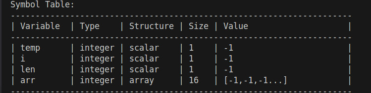
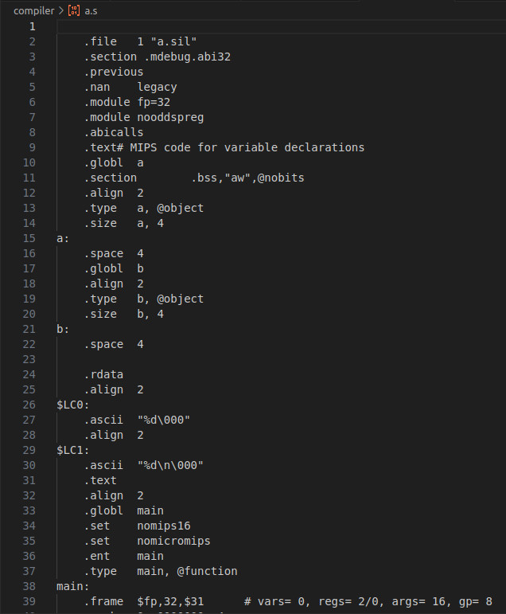

# Compiler for SIL language
# Done under: Compiler Design Course (CS3140)

- **Name**: Bhogaraju Shanmukha Sri Krishna
- **Roll Number**: 112201013
## About
- This is a **compiler** developed for a custom-defined programming language called **SIL**.
- The language was designed to practice and demonstrate compiler construction concepts such as **lexical analysis, parsing, semantic analysis, and code generation**.
- The formal syntax and grammar of SIL can be found [here](docs/syntax.md).  

## Features
- **Lexical Analysis**: Implemented using Lex (tokenization of identifiers, literals, operators, and keywords).
- **Parsing**: Implemented using Yacc to handle grammar rules and build parse trees.
- **Semantic Analysis**: Type-checking, scope resolution, and error reporting.
- **Intermediate Representation (IR)**: Abstract Syntax Tree (AST) generation for further processing.
- **Code Generation**: Converts SIL programs into **MIPS assembly code**.

## Project structure
```text
.
├── calculator                    # Command line calculator: done as an assignment  
│   ├── calculator.hpp
│   ├── calculator.l
│   ├── calculator.y
│   ├── hoc.h
│   ├── hoc.y
│   ├── infile.txt
│   ├── init.c
│   ├── Makefile
│   ├── math.c
│   └── symbol.c
├── CHANGELOG.md                  # Recorded changes over the phases of the project
├── compiler                      # Has the core compiler code for SIL language
│   ├── include
│   │   ├── common.h
│   │   └── tree.hpp
│   ├── Makefile
│   ├── qemu.sh
│   └── src
│       ├── codeGen.cpp
│       ├── compiler.cpp
│       ├── compiler.l
│       └── compiler.y
├── docs  
│   └── syntax.md                 # Syntax of the language
├── README.md                     # Project info (this file)
├── static                        # Pictures of output
│   ├── AST.jpeg
│   ├── mips_file.jpeg
│   └── symtab.jpeg
├── test-2                        # test 2 exam for the course
│   ├── bin
│   │   └── compiler
│   ├── include
│   │   └── tree.hpp
│   ├── Makefile
│   ├── src
│   │   ├── compiler.cpp
│   │   ├── compiler.l
│   │   └── compiler.y
│   └── tests
│       ├── test1a.sil
│       ├── test1b.sil
│       └── test1c.sil
└── tests                         # all the tests used for the sil compiler along with the expected output
    ├── assignment-2-testcases
    │   ├── 1-output.txt
    │   ├── 1.prog
    │   ├── 2-output.txt
    │   ├── 2.prog
    │   ├── 3-output.txt
    │   ├── 3.prog
    │   └── 4.prog
    ├── assignment-3-testcases
    │   ├── gpt-testcase.sil
    │   ├── my-test.sil
    │   ├── sample-prog1.sil
    │   ├── sample-prog.sil
    │   ├── test2.sil
    │   ├── test3.sil
    │   ├── test4.sil
    │   └── test.sil
    ├── Assignment4_Test_Cases
    │   ├── a.sil
    │   ├── b.sil
    │   ├── c.sil
    │   ├── d.sil
    │   ├── sample1.sil
    │   ├── sample2.sil
    │   ├── sample3.sil
    │   ├── sample4.sil
    │   ├── test1.sil
    │   ├── test2.sil
    │   └── test3.sil
    └── Cprograms_and_MIPS_Assembly_Code
        ├── s1.c
        ├── s1.s
        ├── s2.c
        ├── s2.s
        ├── s3.c
        ├── s3.s
        ├── s4.c
        ├── s4.s
        └── test2.c
```


## Requirements
- **Operating System**: Linux (tested on Ubuntu/Mint, but should work on other Linux distributions)
- **Build Tools**:
  - `make` (for build automation)
  - `gcc` (C compiler)
  - `g++` (C++ compiler)
- **Lex and Yacc**:
  - `flex` or `lex` (for lexical analysis)
  - `bison` or `yacc` (for parsing)
- **MIPS Toolchain**:
  - `mips-linux-gnu-gcc-10` (cross-compiler for MIPS)
  - `qemu-mips` (to emulate and run MIPS executables)


## Installation instructions

### To Run:

1. Go to compiler directory
```bash
cd compiler/
```

2. Build the executable
```bash
make
```

3. Compile an input file `a.sil`
```bash
./bin/compiler a.sil
```
Output will be found in directory `compiler/`

4. Compile `a.s` to mips executable
```bash
mips-linux-gnu-gcc-10 a.s -o a.o
```

5. Run the object file in qemu
```bash
qemu-mips -L /usr/mips-linux-gnu/ a.o
```

### Implementation Details:
- Compiler executable is located at `compiler/bin/compiler` (after building using make)
- Mips assembly code is generated at `compiler/` location after compiling with `compiler/bin/compiler`

### Output:
- **AST**:  
    

- **Symbol table**:  
    

- **Mips assembly file**:  
    
